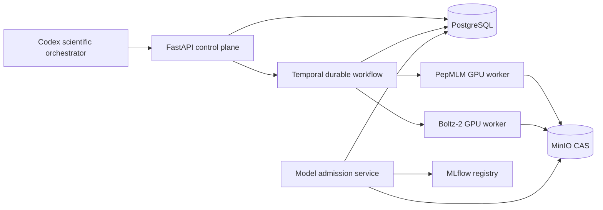
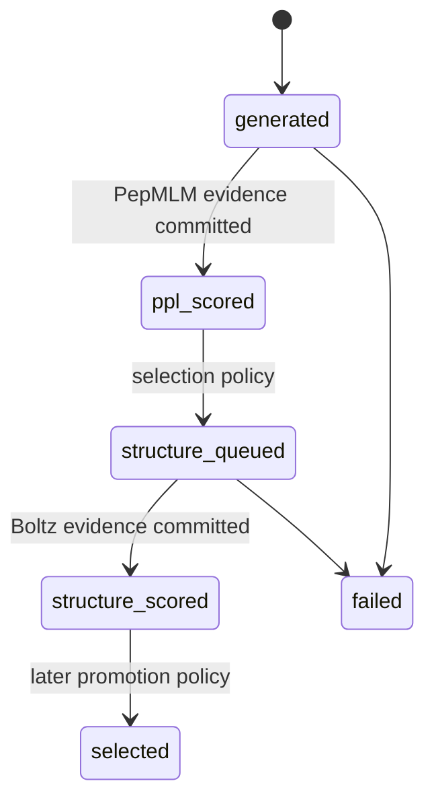

# PepAgent MVP architecture

## System boundary

Codex proposes and supervises scientific work, but chat history is never canonical state. The
control plane accepts a versioned experiment specification and Temporal owns execution. PostgreSQL
owns identities, state, metrics and the append-only lifecycle; MinIO owns immutable byte artifacts;
MLflow owns model-release aliases and calibration experiments.

## Active decision loop

1. Validate and hash the target-conditioned experiment specification.
2. PepMLM generates seeded candidates and computes conditional NLL/PPL.
3. A control activity persists the model call, environment, raw output, candidates and evaluations.
4. The lowest-PPL fraction is promoted to `structure_queued`.
5. Boltz-2 predicts a protein-chain/peptide-chain complex without invoking an affinity head.
6. A control activity persists the checkpoint manifest, complex files and confidence metrics.
7. Temporal finalizes the run only after all required evidence is committed.

No absolute-affinity metric is admitted in MVP v1. PepPAP is frozen. PPI-Affinity remains outside
the workflow until versioned code and weights are replayable. Rosetta FlexPepDock is a later P1
relative structural rescorer.

## Non-negotiable evidence invariants

- A candidate sequence is unique within a run by SHA-256.
- A tool call is idempotent on run, tool/version, environment, weights, input, parameters and seed.
- Every successful model call has normalized input JSON, input/output hashes, executed weight hash,
  molecular-resource hash, environment hash, exact platform-release SHA-256, attempt number and
  raw-output artifact.
- Artifact keys are content hashes; database rows reference immutable `s3://` URIs.
- Metrics never stand alone: every evaluation references both a candidate and a tool call.
- Workflow retries may re-execute computation but cannot duplicate canonical evidence.
- A replay run keeps `parent_run_id` and the exact original `spec_json`/`spec_sha256`.
- Model releases must pass an admission gate before an MLflow `admitted` alias is assigned.

## Candidate lifecycle

## Security and deployment boundaries

GPU workers connect outward only through two loopback-bound reverse SSH forwards: Temporal and the
MinIO S3 API. SSH authentication uses the installed DPAPI/ASKPASS helper. Remote worker concurrency
is one activity per process and each role is pinned to an explicitly selected GPU. PostgreSQL is not
exposed to the GPU server; control activities perform canonical database writes locally.
