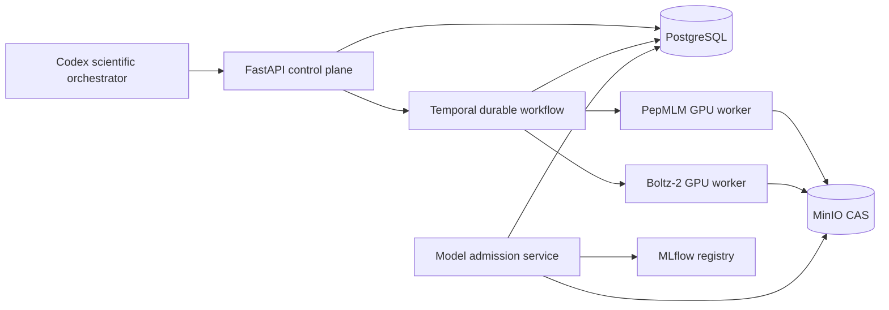
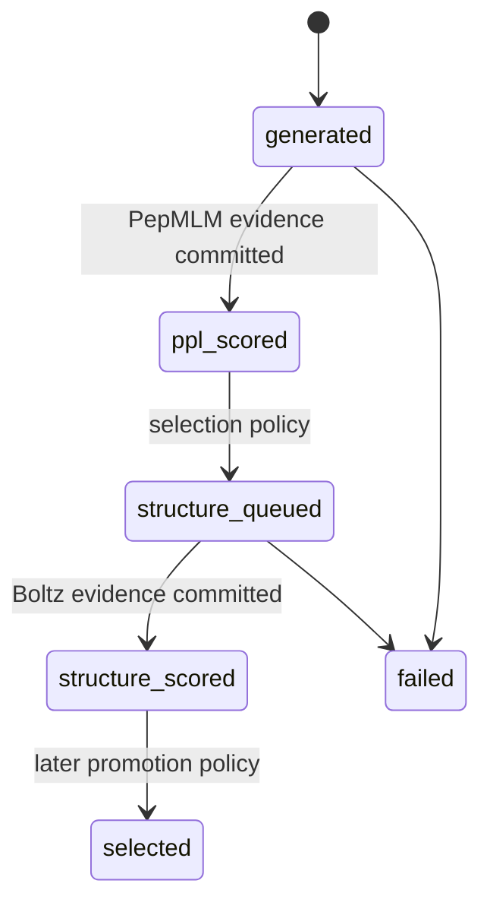

# PepAgent MVP architecture

## System boundary

Codex proposes and supervises scientific work, but chat history is never canonical state. The
control plane accepts a versioned experiment specification and Temporal owns execution. PostgreSQL
owns identities, state, metrics and the append-only lifecycle; MinIO owns immutable byte artifacts;
MLflow owns model-release aliases and calibration experiments.

## Active decision loop

1. Validate and hash the target-conditioned experiment specification.
2. PepMLM generates seeded candidates and computes conditional NLL/PPL.
3. A control activity persists the model call, environment, raw output, candidates and evaluations.
4. The lowest-PPL fraction is promoted to `structure_queued`.
5. Boltz-2 predicts a protein-chain/peptide-chain complex without invoking an affinity head.
6. A control activity persists the checkpoint manifest, complex files and confidence metrics.
7. Temporal finalizes the run only after all required evidence is committed.

No absolute-affinity metric is admitted in MVP v1. PepPAP is frozen. PPI-Affinity remains outside
the workflow until versioned code and weights are replayable. Rosetta FlexPepDock is a later P1
relative structural rescorer.

The Boltz-2 structure lane and affinity lane are separate capabilities. A peptide is represented as
a second protein chain for complex co-structure prediction; the official protein-small-molecule
affinity head remains hard-disabled. Structure confidence is never relabelled as peptide affinity.

## Non-negotiable evidence invariants

- A candidate sequence is unique within a run by SHA-256.
- A tool call is idempotent on run, tool/version, environment, weights, input, parameters and seed.
- Every successful model call has normalized input JSON, input/output hashes, executed weight hash,
  molecular-resource hash, environment hash, exact platform-release SHA-256, attempt number and
  raw-output artifact.
- Artifact keys are content hashes; database rows reference immutable `s3://` URIs.
- Metrics never stand alone: every evaluation references both a candidate and a tool call.
- Workflow retries may re-execute computation but cannot duplicate canonical evidence.
- A replay run keeps `parent_run_id` and the exact original `spec_json`/`spec_sha256`.
- Model releases must pass an admission gate before an MLflow `admitted` alias is assigned.

## Experiment-attempt graph contract

The product graph UI is deferred, but its canonical graph must be created by execution rather than
reconstructed from logs. Generation, screening, each structure sample, coordinate audit, snapshot
render, Codex snapshot review, Rosetta decoy aggregation and promotion decision are separate attempt
nodes. An attempt stores immutable input/output hashes, exact tool/model/prompt/render versions,
parameters, seed, status, timestamps, retries and artifact references. A many-to-many dependency
edge records relations such as `generated_from`, `evaluates`, `renders`, `reviews`, `refines` and
`selected_by`.

PostgreSQL owns nodes, edges and lifecycle state; MinIO owns the content-addressed bytes; Temporal
owns execution state and monitoring. A future graph is only a projection of those records.

## Watchdog supervision

The research director does not busy-poll long compute. An independent watchdog observes Temporal
heartbeats and retries, new PostgreSQL evidence, real worker subprocesses, and artifact freshness.
It wakes the director only at generation boundaries, terminal failures, scientifically abnormal
outputs, or final completion. A `running` state without fresh evidence is treated as possible
stagnation. The watchdog cannot change scores, parents, or an experiment specification; any
spec-changing recovery creates a new versioned run while preserving the failed branch.

## Search-regime diagnosis and escalation

Repeated local iterations are not evidence that sequence space has been adequately explored. The
research harness must distinguish three different explanations for a plateau:

1. **selection-limited**: proposals are diverse, but a selection policy or qualification removes
   useful regions;
2. **evaluator-limited**: sequence diversity is adequate, but structure seeds are noisy or every
   candidate fails the same pocket/interface test;
3. **generator-limited**: independent seeds repeatedly emit the same motifs and lineages, so local
   mutation is searching a narrow learned output distribution.

Every generation must persist a search-regime report in addition to candidate scores. Its minimum
diagnostics are proposal-attempt yield, exact-duplicate rate, unique-sequence fraction,
length-stratified residue entropy, dominant-motif and largest-sequence-cluster fractions, median
pairwise similarity, distance from parents, parent-lineage concentration, qualification-pass
fraction, structure-gate-pass fraction and quality improvement relative to the preceding
generation and preceding versioned run. Diagnostics are computed before and after qualification so
the system can tell generator collapse from a narrow feasible region.

Thresholds and patience are experiment-policy fields, not constants hidden in selection code. A
typical escalation trigger requires both (a) no meaningful improvement for at least two completed
generation/run comparisons and (b) at least two independent narrowness signals, such as high
duplicate/cluster concentration, low residue entropy or very small parent distance. A plateau alone
does not prove generator collapse. Conversely, a high unique count alone does not prove useful
coverage if all sequences share the same motif or lineage.

The controller uses a versioned escalation ladder:

- **E0 -- local exploitation**: current sampler, small parent mutations and the normal de-novo
  quota.
- **E1 -- distribution broadening**: increase temperature and token support (`top_k`/`top_p`),
  expand mutation count and peptide-length strata, raise the independent de-novo quota, and retain
  a fixed budget per proposal lane before objective ranking.
- **E2 -- heterogeneous proposal mixture**: combine parent mutation, high-entropy de-novo PepMLM,
  explicitly composition-constrained proposals, motif-penalized resampling and an independent
  baseline generator. Each lane keeps its own provenance and minimum screening quota so the
  incumbent model cannot suppress challengers solely through its own PPL.
- **E3 -- generator challenge**: run a bounded head-to-head experiment against a different model,
  checkpoint or conditioning representation using identical downstream qualifications and
  structure budgets. Compare feasible yield, coverage and downstream hit rate, not only PPL.
- **E4 -- model/conditioning redesign**: only after the challenge demonstrates a systematic output
  defect, change training data, fine-tuning, pocket conditioning or generator family. This is a new
  model-release admission task, never an in-place parameter tweak.

An escalation changes scientific intent and therefore always creates a new hashed experiment spec,
new run and explicit `supersedes`/`tests_hypothesis` edges. The plateaued run remains immutable
negative evidence. Codex or a future knowledge base may explain failure patterns and propose the
next ladder step, but code validates the trigger inputs, enforces qualification rules and records
the comparison. Prompts cannot waive a hard constraint.

The phrase “space exploration is complete” is permitted only after at least one broadened or
independent proposal lane has failed to add feasible sequence clusters or improve downstream
evidence. Failure of several near-identical PepMLM runs establishes a narrow-generator result, not
exhaustion of peptide sequence space.

## Snapshot-critic admission

Coordinate-derived interface checks remain the structural promotion gate. A deterministic
multi-view render bundle may be reviewed by a pinned multimodal Codex model as a shadow-mode critic
to detect and explain gross or combined failure modes. The review is evidence, not a fitness metric:
it cannot report affinity or silently change a score. It becomes decision-bearing only after a
versioned protein-peptide validation set shows stable incremental value over coordinate checks
alone. Every review stores model snapshot, prompt schema/hash, render recipe and camera parameters,
image hashes, structured output and raw response.

The snapshot critic is a separate auxiliary service, not a Temporal activity in the Auto Research
workflow. It subscribes to completed structure artifacts asynchronously. Its absence, failure or
latency cannot block candidate promotion, Rosetta scoring or another research round.

## Candidate lifecycle

## Security and deployment boundaries

GPU workers connect outward only through two loopback-bound reverse SSH forwards: Temporal and the
MinIO S3 API. SSH authentication uses the installed DPAPI/ASKPASS helper. Remote worker concurrency
is one activity per process and each role is pinned to an explicitly selected GPU. PostgreSQL is not
exposed to the GPU server; control activities perform canonical database writes locally.
