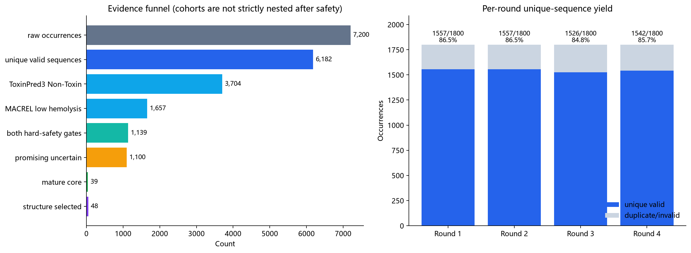
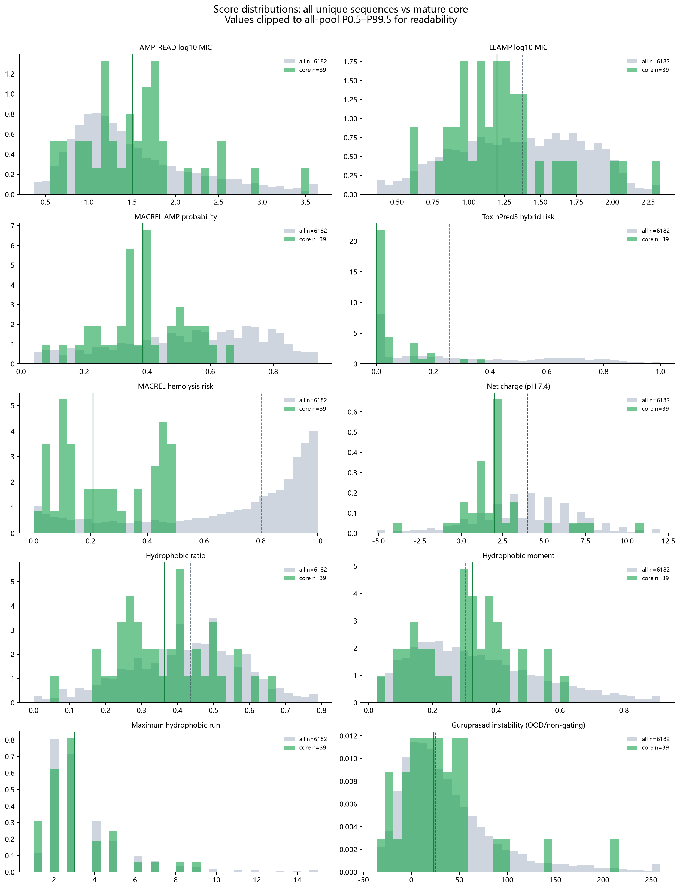
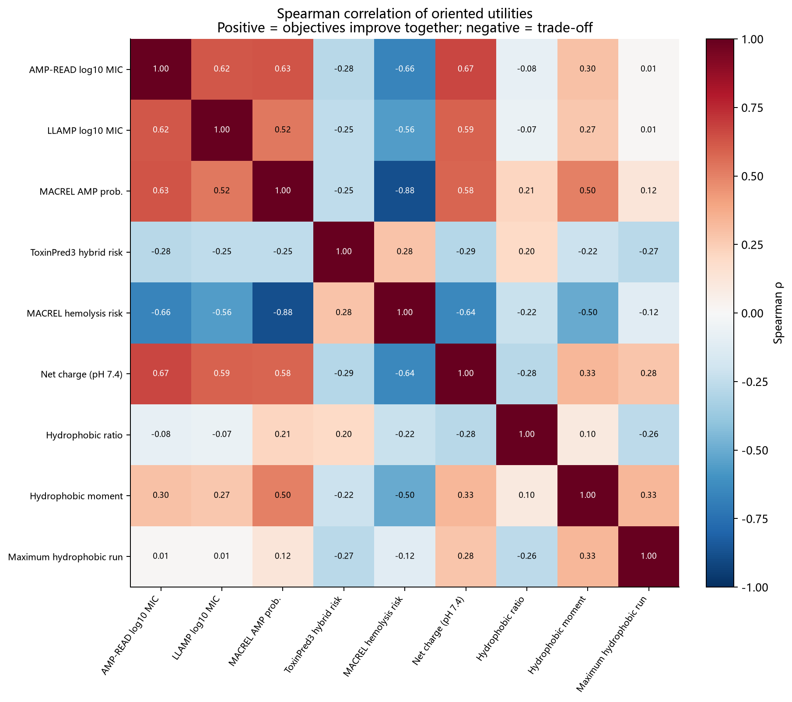
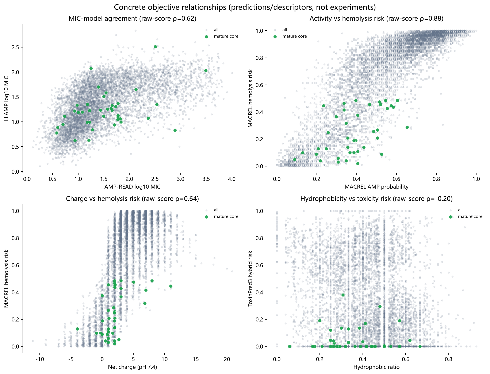
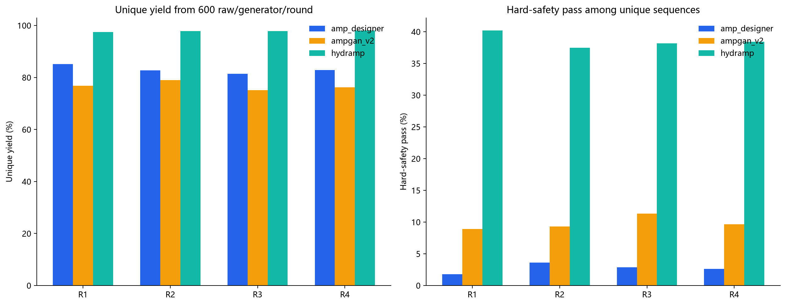
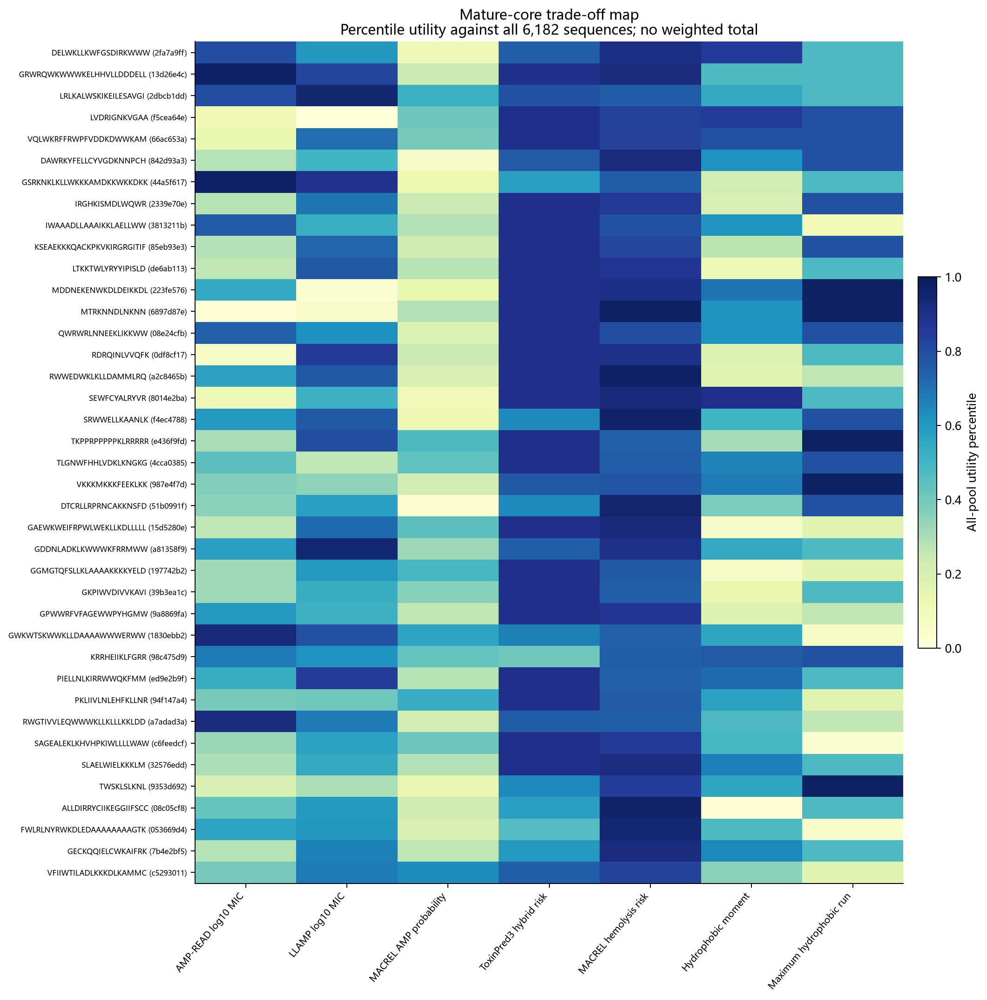

# v39 四轮序列探索：面向技术面试官的通俗分析报告

生成时间：2026-08-24T08:14:48.213887+00:00
用户给定任务：`019fb225-0b2b-7b20-b258-24c1924f560e`（Codex 任务“MVP”，不是 PostgreSQL run ID）
权威控制 run：`5557e950-5bd9-551d-ae1d-948f0ca29d0b`
跨轮决策 SHA-256：`b1cbf8cbd2a0a688ae1ec18fe35cafcce709b84e992bf6e945617bb71e972fc5`

## 先说人话：我们做到了什么

把项目想成招聘漏斗：机器先“海投”了 7,200 份短肽简历，去重后留下 6,182 个不同候选；每个候选都参加了 12 项计算机预测考试。安全考试先淘掉大多数候选，综合比较后留下 39 个核心候选，再把 48 个候选送入更昂贵的三维结构复核。

所以结论不是“已经找到药”，而是：**我们已经完成了计算机初筛，得到了一批值得继续验证、但尚未被实验确认的候选。** 数据管线表现好；候选质量有亮点也有明显冲突；项目正在结构计算阶段，还没到可以把候选称为实验样本成品的阶段。

## 1. 项目全景：现在走到哪一步

| 阶段 | 完成度 | 当前证据 | 面试官式判断 |
|---|---:|---|---|
| 生成候选 | 100% | 4 轮共 7,200 次生成 | 已完成，搜索量足够做一次正式比较 |
| 12 项序列打分 | 100% | 6,182 条 × 12 项 = 74,184 条评价，缺失 0 | 数据完整性好 |
| 跨轮筛选 | 100% | 1,139 条通过双安全预测；39 条核心；48 条进入结构预算 | 已得到候选组合，但不是实验结论 |
| 双靶点结构复核 | 15.5% | 已落库 1,513/9,792 条结构证据；7/48 条候选完整，另有 1 条进行中 | **当前正在这里** |
| 最终组合与可重复性核对 | 0% | 必须等结构证据闭合 | 尚未开始，不能宣布最终候选 |
| 合作方资格与参考肽 pilot | 未验收 | 已有实验合同/RFQ框架，但无合格的候选湿实验结果 | 可以现在接洽，不能现在发送项目候选 |
| 项目候选湿实验 | 0% | MIC、溶血、皮肤细胞毒性、稳定性均无实测 | 实验有效性和安全性仍未知 |

如果面试官只问“项目现在好还是差”，最准确的回答是：

- **绿色——工程和数据质量：好。** 生成、去重、12 项评价和跨轮筛选都完整，没有缺分，也保留了可追溯证据。
- **黄色——候选质量：有希望但不稳。** 安全预测确实改善，也有 39 条多目标核心；但活性模型互相不完全同意，安全和活性存在明显冲突。
- **黄色——结构阶段：运行正常但只完成一小部分。** 当前约 15.5%，还不能用前 7 条代表全部 48 条。
- **红色——实验准备度：尚未放行。** 不是因为没有候选，而是因为实验室资格、参考对照、数据权利、最终候选清单和所有真实实验结果都未闭合。

整体定位是：**一个完成了计算初筛、正在做结构复核的候选发现项目，不是已经完成临床前验证的药物项目。**

结构进度快照：2026-08-24T08:14:41.321229+00:00；最近一条结构证据：2026-08-24T08:11:58.031742+00:00。当前数据库状态为 `running`。完整结构合同是每条候选 2 个靶点 × 正确/错误口袋 × 3 个随机种子，并为每个姿势生成 16 个 Rosetta 对照构象，因此总量大，不能把“已有部分结构记录”误读为结构阶段完成。

术语只需记住三句：结构复核是在电脑里检查短肽是否以较稳定、较有选择性的方式靠近目标蛋白；Rosetta 是对同一预测姿势生成许多小变化并作相对能量比较，不是测亲和力；reference pilot 是先用结果已知的参考肽考核合作实验室，避免把实验室流程问题误判成项目候选失败。

### 什么时候联系合作方、什么时候送样

答案要拆成三件事：

1. **现在就可以、也应该联系合作方。** 现在联系的目的不是宣传“我们已经有药”，而是同步保密协议、报价、样本量、纯度/QC、菌株与细胞来源、原始数据交付格式、数据权利和时间表，并安排已知参考肽的盲法 pilot。这些工作可以与结构计算并行。
2. **参考肽可以先送。** 合作方只有用 melittin、LL-37 等已知对照完成 reference pilot，并交付可审计的原始数据后，才证明其实验流程可靠。参考肽不是我们的项目候选，因此不会提前泄露或浪费候选。
3. **项目候选暂时不要送。** 最低放行条件是：合作方 pilot/QC 与数据权利验收通过；本轮结构组合和最终可重复性核对完成；内部冻结一个分层候选清单和对照清单；合成纯度、质谱、溶解方式、盲法编号与样本量全部确认。届时发送的是一组代表不同优势/风险的候选，不是押注一个“冠军”。

换句话说：**商务和实验设计联络从今天开始；项目候选送样要等“外部实验室合格”和“内部最终清单冻结”两条线同时变绿。** 当前不能给出可靠日历日期，因为数据库只证明结构任务正在执行，没有提供合作方书面周期、参考 pilot 排期和验收结果。应该用门槛管理，而不是凭感觉报日期。

## 2. 第一张图：候选漏斗是否健康

- 原始生成：7,200（4 轮 × 1,800）。
- 有效唯一序列：6,182；重复或无效 1,018，损耗 14.1%。
- 两个安全模型同时判为较安全：1,139（18.4%）。
- 最终状态：淘汰 5,043；有希望但证据冲突 1,100；核心候选 39。
- 结构复核池：48（39 条核心 + 9 条探索候选）。

**怎么读图：** 左边每根柱子是一次淘汰后的剩余人数，越往右门槛越严；右边比较四轮各自生成了多少不同序列，判断后续轮次是不是只在重复旧答案。

**图里真正说明了什么：** 14.1% 的重复/无效损耗不算崩盘，四轮仍持续贡献新序列；但安全筛选是最大的瓶颈，81.6% 的候选至少未同时通过两个安全预测。39 个核心看起来只占 0.63%，这并不自动代表生成失败，因为多目标药物筛选本来就会大幅收缩；它代表的是实验前预算已经被有效压缩。

**图不能说明什么：** 漏斗越窄不等于候选越安全或越有效。这里只能证明规则把候选筛少了，不能证明规则预测正确，更不能替代真实 MIC、溶血或细胞实验。

## 3. 分数到底好不好

| 指标 | 方向 | 全体均值/中位数 | 核心均值/中位数 | 全体 P10–P90 | 核心相对变化 |
|---|---|---:|---:|---:|---|
| AMP-READ log10 MIC | 越低越有利 | 1.501/1.311 | 1.541/1.501 | 0.765–2.580 | 接近（标准化位移 0.06） |
| LLAMP log10 MIC | 越低越有利 | 1.355/1.371 | 1.231/1.196 | 0.750–1.933 | 改善（标准化位移 -0.30） |
| MACREL AMP probability | 越高越有利 | 0.538/0.564 | 0.389/0.386 | 0.198–0.822 | 变差（标准化位移 -0.80） |
| ToxinPred3 hybrid risk | 越低越有利 | 0.335/0.255 | 0.051/0.000 | 0.000–0.780 | 改善（标准化位移 -1.28） |
| MACREL hemolysis risk | 越低越有利 | 0.678/0.802 | 0.250/0.208 | 0.139–0.980 | 改善（标准化位移 -1.72） |
| Net charge (pH 7.4) | 非单调描述 | 3.810/3.987 | 2.107/1.989 | -0.012–7.984 | 分布位移（标准化位移 -0.59） |
| Hydrophobic ratio | 非单调描述 | 0.423/0.435 | 0.366/0.364 | 0.211–0.615 | 分布位移（标准化位移 -0.39） |
| Hydrophobic moment | 越高越有利 | 0.338/0.302 | 0.303/0.325 | 0.108–0.624 | 变差（标准化位移 -0.20） |
| Maximum hydrophobic run | 越低越有利 | 3.496/3.000 | 3.231/3.000 | 2.000–6.000 | 接近（标准化位移 -0.13） |
| Guruprasad instability | 越低越有利 | 38.393/24.938 | 29.751/23.188 | -11.662–104.478 | 接近（标准化位移 -0.17） |

先解释 MIC：它是“抑制细菌需要多大浓度”，像灭火需要多少水，数字越小通常越好。表里的 MIC 经过 log10 变换：1 约等于 10 µM，2 约等于 100 µM，3 约等于 1,000 µM。概率类模型则是模型的信心，不是实验成功概率。

结论不能简单说“好”或“差”：核心候选在 ToxinPred3 风险、MACREL 溶血风险和 LLAMP MIC 上明显变好，但 AMP-READ MIC 基本没变，MACREL 活性概率反而变低。这说明筛选成功降低了模型眼中的安全风险，却付出了一部分预测活性代价。净电荷和疏水比例都不是越大越好；核心整体更克制，符合避免强膜破坏的一般设计逻辑。Guruprasad instability 对短肽有 4,147/6,182 条超出适用范围，因此只能旁观，不能据此淘汰。

**怎么读图：** 每个小图是一项考试的成绩分布。灰色代表全部 6,182 条候选，蓝色代表最后 39 条核心；蓝色整体向“有利方向”移动才叫改善。分布重叠越多，说明筛选前后差异越小。

**图里真正说明了什么：** 安全相关的蓝色分布明显移向低风险区，是最清楚的改善；LLAMP MIC 也向较低位置移动。相反，MACREL AMP probability 的核心分布更低，说明不能把这 39 条描述为“所有模型都觉得活性强”。这正是多目标筛选的代价：我们保留的是折中解，不是每门考试都第一名的学生。

**图不能说明什么：** 分布位移只比较模型输出，不能换算成真实人体安全性或某个菌株的实验 MIC。模型可能共享训练数据或偏差，因此多模型一致也不等于独立实验复现。

标签硬门的具体效果：

- ToxinPred3 Non-Toxin：3,704/6,182（59.9%）。
- MACREL low hemolysis：1,657/6,182（26.8%）。
- mature core：两类标签均 100% 通过；这证明规则执行有效，但不等于实验安全。

## 4. 目标为什么会打架

相关热图已把每个有方向的指标转换为“数值越高越有利”的秩，因此负相关可直接读作冲突。

**怎么读热图：** 每个格子比较两项目标是否一起变好。接近 +1 表示“一个好时另一个通常也好”，接近 -1 表示“改善一个往往牺牲另一个”，接近 0 表示没有稳定的直线关系。这里已统一换成“越高越有利”，所以红/负值可以直接理解为冲突。

**最重要的格子：** MACREL 活性与溶血安全为 -0.876，是强冲突；它符合一个直观机制：越擅长扰动细菌膜的肽，也可能越容易伤害红细胞膜。电荷、疏水性与安全指标也出现冲突，说明不能靠不断增加正电荷和疏水氨基酸来刷活性。

**热图的限制：** 相关不等于因果。它只能告诉我们哪些目标经常一起变化，不能证明某个理化性质直接导致毒性；净电荷和疏水比例还存在非线性，单个相关系数会丢失细节。

**怎么读散点图：** 每个点是一条短肽。理想候选应靠近“两项目标都好”的角落；如果点云形成斜带，说明两个目标存在系统关系；如果同一位置很分散，说明一个指标不足以预测另一个。

**四幅图给出的行动建议：** 两个 MIC 模型方向大体一致，但不会挑出完全相同的优胜者；MACREL 活性越高时，溶血安全明显更差；极端电荷或疏水区聚集了更多风险点。因此下一轮应该专门寻找冲突边界附近的“例外候选”——保持活性但降低安全风险——而不是继续把单个属性推到极端。

最重要的量化结果：

- 两个 MIC 模型：效用 Spearman ρ=0.617；两者各自前 25% 的 Jaccard 仅 0.414，直接对立率 1.8%。二者不能互相替代。
- MACREL 活性 vs MACREL 溶血风险：效用 ρ=-0.876，直接对立率 38.6%。活性提高伴随溶血风险上升的趋势是当前最实际的 trade-off 之一。
- MACREL 活性 vs ToxinPred3 风险：效用 ρ=-0.255，直接对立率 20.2%。这是另一条活性—安全张力。
- 净电荷/疏水比例对安全风险呈明显非线性，单看相关系数不足；散点图显示极端区风险更集中，new run 不应继续无边界提高电荷或疏水性。

筛选失败原因（同一候选可有多项）：MACREL 溶血标签失败 4,525；ToxinPred3 标签失败 2,478；rank instability 5,638；超出结构预算 1,091。

## 5. 四轮与生成器：谁真正贡献了可用候选

**怎么读图：** 不要只看生成数量，要按三层看：是否产生不同序列、是否同时通过两个安全预测、是否最终进入核心或结构池。一个生成器“写得多”不等于“交付得多”。

| generator | 唯一序列 | 硬安全通过 | 硬安全率 | mature core | 结构入选 |
|---|---:|---:|---:|---:|---:|
| amp_designer | 1,992 | 54 | 2.7% | 5 | 5 |
| ampgan_v2 | 1,843 | 180 | 9.8% | 8 | 9 |
| hydramp | 2,347 | 905 | 38.6% | 26 | 34 |

**图里真正说明了什么：** HydrAMP 不是只靠数量取胜：它产生 2,347 条不同序列，其中 905 条同时通过安全预测，安全产率 38.6%，并贡献 26/39 条核心。amp_designer 的安全产率只有 2.7%，ampgan_v2 为 9.8%。因此下一轮预算应向 HydrAMP 的安全邻域倾斜，但仍保留另外两个生成器提供不同类型的探索，避免所有候选过度同质化。

**图不能说明什么：** 这不是生成器的通用排行榜。差异可能来自本轮 seed、长度和条件设置，也没有 sequence-family 聚类证明 HydrAMP 的 2,347 条覆盖了更多独立骨架。四轮总去重损耗 14.1%，继续原样加轮次可能边际收益下降。

## 6. 39 条核心候选：没有冠军，只有不同的折中方案

下图把 39 条核心在 7 个主要目标上换成相对于全体 6,182 条的百分位。它不是加权总分；每一行都保留自己的优势与短板。

**怎么读图：** 每一行是一条核心短肽，每一列是一项目标；颜色越有利，代表它相对全部 6,182 条候选排名越靠前。这不是总分，也没有把不同指标偷偷相加。看一行时应寻找“强项很多且没有致命短板”，而不是只找最亮的单格。

**图里真正说明了什么：** 39 条核心呈现多种画像：有的偏安全，有的偏某个 MIC 模型，有的理化性质更均衡。没有一行在所有列都占优，所以当前最合理的实验策略是分层抽样，保留“活性偏强、安全偏强、理化平衡、模型冲突代表”四类，而不是挑一个预测总冠军。

**图不能说明什么：** 百分位只表示在本次候选池中的相对名次；如果整个候选池都不够好，排名第一仍可能实验失败。热图也没有显示合成难度、真实溶解度、血清稳定性和实验误差。

具体应优先人工复核的尾部：

- 核心中 `maximum_hydrophobic_run` 最大者：`SAGEALEKLKHVHPKIWLLLLWAW`，连续疏水段 9；虽然标签门通过，仍需结构/聚集与膜损伤风险复核。
- 核心中 MACREL 溶血概率最大者：`PIELLNLKIRRWWQKFMM`，概率 0.485；接近标签边界的候选不应仅凭 low 标签视为安全。
- 核心中 AMP-READ MIC 最差者：`MTRKNNDLNKNN`，log10 MIC 3.491（约 3099.1 µM）。它能进入核心是因为其他轴保持非支配优势，而不是 AMP-READ 预测优秀。
- 核心中 LLAMP MIC 最差者：`LVDRIGNKVGAA`，log10 MIC 2.509（约 323.0 µM）。

## 7. 证据不足与不能证明的内容

1. 没有实验 MIC、杀菌曲线、细胞毒性或人 RBC 溶血；所有活性/安全结论都是模型预测。
2. 当前 MIC 模型不是病原菌株、培养基、暴露时间条件化的实验端点，log10 MIC 只能同模型内排序。
3. 两个硬安全标签并非独立湿实验；MACREL 与已用数据族的独立性/校准限制仍然存在。
4. Guruprasad instability 对短肽大量 OOD；没有 serum/protease、溶解度、聚集或货架期证据。
5. 双靶点结构目前仅完成 7/48 条候选的完整证据；跨随机种子稳定性、正确/错误口袋对照和最终可重复性核对尚未闭合，不能声称 GyrA/PBP2a 结合、亲和力或选择性。
6. 未提供 sequence-family key/聚类证据，无法严谨判断 6,182 条序列覆盖了多少独立家族，也无法证明搜索饱和。
7. 只有一个多轮 schedule；没有同合同独立重复、对照策略或 paired ablation，不能把分布位移归因于某个 Agent 改动。

## 附录 A：逐打分器完整统计

数值顺序固定为 `min / P10 / P25 / mean / median / P75 / P90 / max / SD`。MIC 为 log10(µM)：例如 1、2、3 分别约等于 10、100、1,000 µM；越低越有利。极值仅描述当前计算证据，不是新阈值。

| 打分器 | n / 缺失 / 失败 / OOD | min / P10 / P25 / mean / median / P75 / P90 / max / SD | 最好序列 | 最差序列 |
|---|---:|---|---|---|
| AMP-READ log10 MIC | 6182 / 0 / 0 / 0 | 0.113 / 0.765 / 0.989 / 1.501 / 1.311 / 1.876 / 2.580 / 4.007 / 0.706 | `GWKKLRRFAAKFAGRAAHKLTAKKA` | `IFYVVCYGMMALMMAWWDDWWW` |
| LLAMP log10 MIC | 6182 / 0 / 0 / 0 | 0.108 / 0.750 / 1.016 / 1.355 / 1.371 / 1.712 / 1.933 / 2.831 / 0.447 | `FKRWWKRFKKFLEKLKRVKIFRKKR` | `FAAADLNKEDLKK` |
| MACREL AMP probability | 6182 / 0 / 0 / 0 | 0.000 / 0.198 / 0.376 / 0.538 / 0.564 / 0.723 / 0.822 / 1.000 / 0.228 | `LKKKLIKIVAKILK` | `GQEFDYRFVFM` |
| ToxinPred3 hybrid risk | 6182 / 0 / 0 / 0 | 0.000 / 0.000 / 0.040 / 0.335 / 0.255 / 0.605 / 0.780 / 1.000 / 0.300 | `INILKTITGSVLK` | `KKLLKWCKKR` |
| MACREL hemolysis risk | 6182 / 0 / 0 / 0 | 0.000 / 0.139 / 0.455 / 0.678 / 0.802 / 0.941 / 0.980 / 1.000 / 0.312 | `AMGDEADDLEESLESSQAA` | `FLKSLKKLAKHAL` |
| Net charge (pH 7.4) | 6182 / 0 / 0 / 0 | -11.120 / -0.012 / 1.988 / 3.810 / 3.987 / 5.986 / 7.984 / 20.833 / 3.175 | `不定义单调最好` | `不定义单调最差` |
| Hydrophobic ratio | 6182 / 0 / 0 / 0 | 0.000 / 0.211 / 0.318 / 0.423 / 0.435 / 0.529 / 0.615 / 0.929 / 0.156 | `不定义单调最好` | `不定义单调最差` |
| Hydrophobic moment | 6182 / 0 / 0 / 0 | 0.003 / 0.108 / 0.182 / 0.338 / 0.302 / 0.463 / 0.624 / 1.102 / 0.199 | `FKKLFRRWIR` | `FGMMDGMMCMSWWWWAAERRRRRRR` |
| Maximum hydrophobic run | 6182 / 0 / 0 / 0 | 0.000 / 2.000 / 2.000 / 3.496 / 3.000 / 4.000 / 6.000 / 25.000 / 2.267 | `KTGRPRRPPPPKPP` | `LLWWWWWWWWWWWWWWWWWWWWWWW` |
| Guruprasad instability | 6182 / 0 / 0 / 4147 | -56.745 / -11.662 / 2.826 / 38.393 / 24.938 / 58.695 / 104.478 / 448.188 / 53.750 | `FINFVYRYRTG` | `PCRRRRRRRRRRRRRFYRRRRRRRR` |

| 标签打分器 | 类别分布 | 缺失 / 失败 / OOD | 有利类别 |
|---|---|---:|---|
| ToxinPred3 label | Non-Toxin: 3,704 (59.9%); Toxin: 2,478 (40.1%) | 0 / 0 / 0 | Non-Toxin |
| MACREL hemolysis label | high: 4,525 (73.2%); low: 1,657 (26.8%) | 0 / 0 / 0 | low |

## 8. new run 与下一阶段建议（按实用优先级）

1. **先闭合当前 48 条结构证据，不重跑本轮。** 当前已有 7 条完整、1 条进行中；完成双靶点 × 正确/错误口袋 × 3 seed × 16 Rosetta，并报告每候选跨 seed 一致性与正确口袋相对错误口袋的差异。继续生成更多序列不会解决眼前最大的不确定性。
2. **下一序列 run 改为冲突定向探索。** 分层覆盖：低/中净电荷、低/中疏水比例、不同长度和 scaffold；对“MACREL 活性高但溶血/毒性风险高”“LLAMP 好但 AMP-READ 差”分别建立 challenger cells，保留 parent/control，不做单向增正电。
3. **补 family 与 novelty 证据。** 每条 Candidate 持久化 `sequence_family_key`，用预注册的 identity/coverage 规则计算 family yield、历史新颖率和每轮新增 family；连续两轮 family/Pareto extension 停滞才换策略。
4. **模型冲突用独立证据解决，不用加权平均掩盖。** 为双 MIC 模型增加菌株/条件化外部校准或独立模型；报告 rank agreement、top-k overlap 和校准误差。没有校准前保持两个 Pareto 轴。
5. **新增真实开发性端点后再设硬门。** 优先小规模 reference-pilot 锁定人 RBC 溶血、原代皮肤细胞毒性、serum/protease stability、solubility/aggregation；当前 39 条只作盲测，不参与阈值拟合。
6. **实验预算有限时采用分层组合，而非冠军。** 从 39 条核心中按“活性偏强 / 安全偏强 / 理化平衡 / 模型冲突代表”各保留若干条，并加入已知对照；最终数量由实验预算决定，不从当前预测强行产生唯一 winner。

7. **现在启动合作方并行路径。** 发出不含项目候选序列的 RFQ/SOW，锁定保密、原始数据、材料与衍生数据权利、参考肽 pilot、报价和排期；用 reference pilot 的验收时间倒推项目候选送样窗口。

## 9. 可复现产物

- `candidate_metrics.csv`：6,182 条候选、12 指标、决策状态与来源。
- `metric_summary.csv` / `label_summary.csv`：全体、硬安全池、mature core、结构池的完整统计。
- `conflict_summary.csv`：目标对的秩相关、前四分位重叠、直接对立率。
- `generator_round_summary.csv`：round × generator 产率。
- `mature_core_candidates.csv`：39 条核心明细。
- `data_quality.csv`：逐打分器完整性、失败与 OOD。
- `analysis_manifest.json`：输入 run、决策 SHA 和全部输出 SHA-256。

科学边界：本报告是同协议的计算探索诊断，不是实验活性、安全、靶点结合、亲和力或临床结论。
